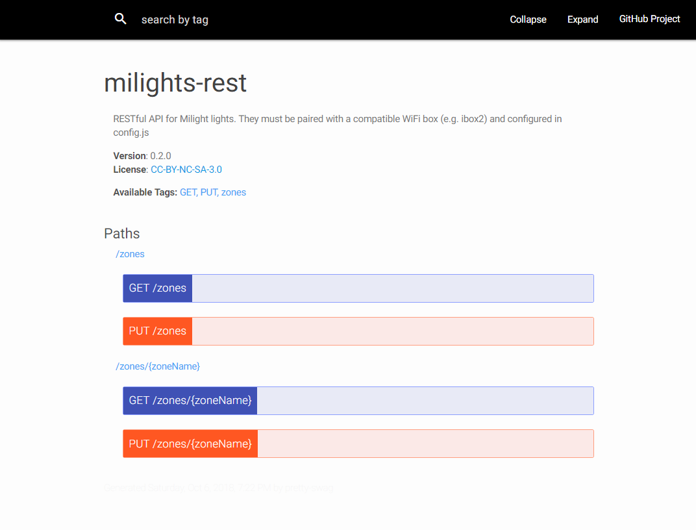

# milights-rest

milights-rest provides a RESTful API to control milight LED bulbs and strips.



## Features

Only v6 protocol full color bulbs (RGB CCT) - 4 zones and 8 zones - are implemented for now.

If you have other hardware and you are willing to help test it feel free to open an issue:

https://github.com/jbchouinard/milights-rest/issues

## Requirements
NodeJS and NPM. 

## Installation

### Install App
```bash
git clone https://github.com/jbchouinard/milights-rest.git
cd milights-rest
npm install
cp config.example.js config.js
nano config.js
```

### Generate API docs
```bash
nano swagger.json  # Change "host" to external IP or hostname of server if you want Swagger docs examples to work
npm install -g pretty-swag
pretty-swag -c pretty-swag.json
```

## Running

### As normal process

```bash
node server.js
```

###  As a service
```bash
npm install -g forever
forever start server.js
forever stop server.js
```
See help for the forever command for logging and other options.

### See Also

[node-milight-promise](https://github.com/mwittig/node-milight-promise): The library this project uses to interface with Milight lights.

[milightsdriver](https://github.com/jbchouinard/milightsdriver) A CLI interface, and a scheduler for milights-rest.

## License

[CC BY-NC-SA 3.0](https://creativecommons.org/licenses/by-nc-sa/3.0/)

**milights-rest**  &copy; Jerome Boisvert-Chouinard 2018.

Derived from **milights-bridge** &copy; [Kevin Van Ryckegem](http://signaware.com) 2017. All Rights Reserved.
